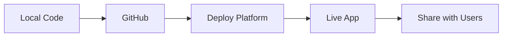

# 🔗 Anonymous Chat App - Production Ready

A secure, temporary, and completely anonymous chat application with shareable links. **Now ready for deployment!**

## 🚀 Quick Deploy (< 5 minutes)

### Option 1: Render.com (Easiest)
1. **Fork/Clone this repository**
2. **Go to [render.com](https://render.com)** and sign up with GitHub
3. **Click "New +" → "Web Service"**
4. **Connect your repository**
5. **Use these settings:**
   - Build Command: `pip install -r requirements.txt`
   - Start Command: `gunicorn --worker-class eventlet -w 1 app:app`
6. **Deploy!** ✨

Your app will be live at: `https://yourapp.onrender.com`

### Option 2: Railway.app
1. **Push to GitHub**
2. **Go to [railway.app](https://railway.app)**
3. **Deploy from GitHub repo** - Railway auto-detects Python
4. **Done!** 🎉

### Option 3: Quick Docker
```bash
docker build -t anonymous-chat .
docker run -p 5000:5000 anonymous-chat
```

## 📱 How It Works

1. **Create Room:** Generate a shareable link
2. **Share Link:** Send to friends via any platform
3. **Join & Chat:** Recipients click link and join instantly
4. **Auto-Delete:** All messages deleted after 30min inactivity

## 🛡️ Privacy Features

- ✅ **Zero Registration** - No accounts needed
- ✅ **Auto-Expiring** - Rooms delete after 30 minutes
- ✅ **No Storage** - Everything in memory only
- ✅ **Anonymous** - No tracking or logging
- ✅ **Secure Links** - 12-character random room IDs

## 🔧 Local Development

```bash
# Clone the repository
git clone https://github.com/yourusername/anonymous-chat.git
cd anonymous-chat

# Install dependencies
pip install -r requirements.txt

# Run locally
python app.py

# Visit: http://localhost:5000
```

## 📁 Project Structure

```
anonymous-chat/
├── app.py              # Flask app with SocketIO
├── requirements.txt    # Python dependencies
├── Procfile           # Deployment configuration
├── runtime.txt        # Python version
├── Dockerfile         # Container configuration
├── templates/
│   └── index.html     # Frontend (HTML/CSS/JS)
├── .env.example       # Environment variables
├── .gitignore         # Git ignore rules
├── DEPLOYMENT.md      # Detailed deployment guide
└── README.md          # This file
```

## 🌐 Live Demo

Try the live demo: `[YOUR-DEPLOYED-URL-HERE]`

## 💡 Features

- **Real-time messaging** with WebSockets
- **Responsive design** - works on mobile/desktop
- **One-click copy** for easy link sharing
- **Participant counter** shows active users
- **Message history** for late joiners
- **Auto-cleanup** prevents memory leaks

## ⚙️ Environment Variables

| Variable | Default | Description |
|----------|---------|-------------|
| `PORT` | `5000` | Server port (set by platform) |
| `FLASK_ENV` | `production` | Flask environment |
| `SECRET_KEY` | `auto-generated` | Session security |
| `CORS_ALLOWED_ORIGINS` | `*` | Allowed CORS origins |

## 🔄 Deployment Process



## 🆓 Free Hosting Options

| Platform | Free Tier | Sleep | HTTPS | Custom Domain |
|----------|-----------|-------|-------|---------------|
| **Render** | 750h/month | ✅ | ✅ | Paid |
| **Railway** | $5 credit | ❌ | ✅ | ✅ |
| **Heroku** | Limited | ✅ | ✅ | ✅ |

## 🛠️ Tech Stack

- **Backend:** Flask + SocketIO
- **Frontend:** Vanilla HTML/CSS/JavaScript
- **Real-time:** WebSocket connections
- **Deployment:** Gunicorn + Eventlet
- **Containerization:** Docker ready

## 📋 TODO for Production

- [x] Environment variable configuration
- [x] Production WSGI server (Gunicorn)
- [x] WebSocket support (Eventlet)
- [x] CORS handling
- [x] Error handling
- [x] Auto-cleanup background tasks
- [x] Deployment configurations
- [x] Docker support
- [ ] Rate limiting (optional)
- [ ] Analytics (optional)

## 🤝 Contributing

1. Fork the repository
2. Create a feature branch
3. Make your changes
4. Test locally
5. Submit a pull request

## 📄 License

MIT License - Feel free to use and modify!

## 🔗 Links

- **Documentation:** [DEPLOYMENT.md](DEPLOYMENT.md)
- **Issues:** [GitHub Issues](https://github.com/yourusername/anonymous-chat/issues)
- **Live Demo:** [Your deployed URL]

---

**Ready to deploy?** Follow the [DEPLOYMENT.md](DEPLOYMENT.md) guide for detailed instructions!

## 🎯 Perfect For

- **Quick team chats**
- **Anonymous feedback**
- **Temporary support channels**
- **Private discussions**
- **Event coordination**
- **Remote meetings**

**Start sharing anonymous, secure conversations today!** 🚀
